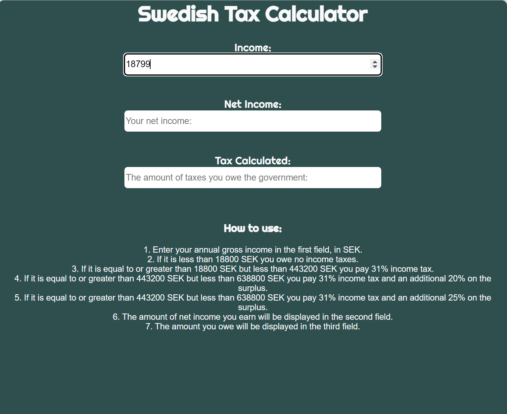
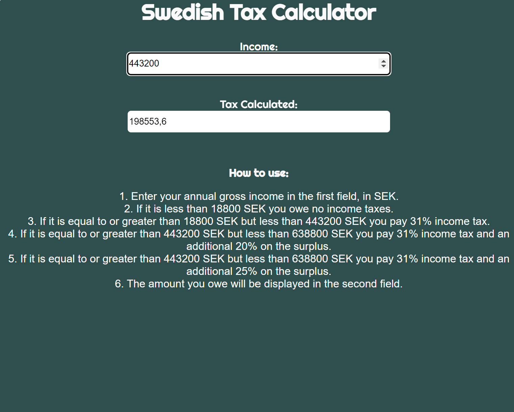
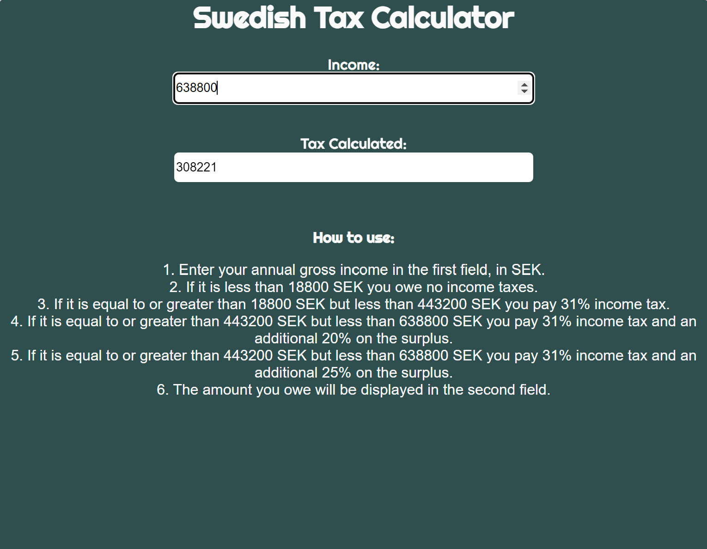

# Income Tax Calculator 

[View the published application on Github]( https://hemenhk.github.io/income-tax-calculator/)

## Project Overview

Income Tax Calculator is a website that aims to provide the user with a simple way of determining how much taxes they owe the government annually. This only applies to Swedish users. 
The website offers four tax brackets which the user might fall into: 

The first bracket is for those that earn less than 18800 SEK, which excludes them from paying income taxes. 

The second is for those that earn more than 18800 SEK and less than 443200 SEK, which results in a standard income tax of 31%.

The third is for those that earn more than 443200 SEK but less than 638800 SEK, which results in a standard 31% income tax and then a 20% tax on the surplus. 

The fourth is for those that earn more than 638800SEK SEK, which results in a standard 31% income tax and then a 25% tax on the surplus. 

This site has been created as part of my second project for Code Institute.

## Table of Contents

1. [Strategy]
    * [Project Goals]
    * [User Intention]
    * [Scope]
    * [Design]
    * [Skeleton]
2. [Features](#features)
    * [Current Features]
    * [Future Features]
3. [Technologies Uses]
4. [Testing]
    * [Validation Testing]
    * [Known Bugs and Fixes]
5. [Deployment]
6. [Credits]

## Strategy 

### Project Goals 

The goal of this website is to provide the user a simple way of determining annual income taxes owed to the Swedish government. 

The target audience of this website are Swedish inhabitants that want an easy way to calculate the annual income taxes owed. 

### User Intention 

* __App User Goals:__

    * I want to get an estimation of how much taxes I owe the government.
    * I want to be able to know under which tax bracket I fall into.

* __App Owner Goals:__

    * I want to provide a website allowing the user to calculate their annual income taxes owed to the Swedish government.

## Scope 

To achieve the goals set for this project, I will implement the following features:

* A function that will calculate the annual income taxes in Sweden.
* An if/else statement that seperates the income into four categories, or tax brackets, which has been explained in the 'project overview'.
* An event listener, that listens for the input value added into the income input field. Without it, the website's purpose is void. 

## Design 

The design of this project is extremely simple, as this is a website that only offers one usage. As such, there is no further need for customization. 

## Features 

### Current Features 

__Main__:

The taxCalculate function is the only function found in this project. When this function runs, it calculates the income tax based on an if/else statement. If the user enters a value higher than a specific bracket, then a certain else if statement is executed depending on the value that they entered. 

### Future Features 

Due to the short amount of time, and illness when this project began, there was not enough time to implement addtional features.

* Add a function that calculates the gross income subtracted by the income tax to provide the user with a field displaying their net income. 
* A code to javascript that hides the 'How to use' section in a tab that opens and closes. This way the content detailing how the website functions can be hidden away until the user decides to open it. 

## Technologies Used 

For this project, the languages used are HTML, CSS and Javascript.

I have also used the following tools:

* [GitPod](https://www.gitpod.io/):
    * I used GitPod as the IDE for Income Tax Calculator and git has been used as version control.
* [Github](https://www.github.com/):
    * GitHub was used to create and store the repository, and also received regular commits from GitPod.
* [AmIResponsive](http://ami.responsivedesign.is/):
    * Am I Responsive was used to showcase the application in this README.
* [W3C Markup Validation Service](https://validator.w3.org/nu/#textarea): 
    * W3C was used to validate the HTML document and to identify any issues with the code and syntax erros. 
* [W3C CSS Validation Service](https://validator.w3.org/nu/#textarea): 
    * W3C CSS validation was used to validate the CSS document for this project and to identify any errors in the code.
* [BeautifyTools](https://beautifytools.com/javascript-validator.php): 
    * BeautifyTools was used to validate the javascript document for this project, and to identify any errors in the code.
* [Google Fonts](https://fonts.google.com/): 
    * Google Fonts was used to import fonts to use for this project. 
* [AmIResponsive](http://ami.responsivedesign.is/):
    * Am I Responsive was used to showcase the website in this README.
* [Favicon.io](https://favicon.io/):
    * Favicon was used to create a favicon for this project.
* [Chrome Dev Tools](https://developer.chrome.com/docs/devtools/):
    * Chrome Dev Tools was used to test the website using lighthouse.

## Testing 

### Website Usage 

When the user uses the website, they enter a value in the first input field titled 'income:". They are also presented with a 'How to use:' section that explains how to use the website. 

The image shows that if the user enters a value that is lower than 18800 SEK, the 'Tax Calculated' field will not show any data. 

Screenshot of the first tax bracket:

If the user enters a value equal to or greater than 18800 SEK but less than 443200 SEK, then a standard income tax of 31% is applied.

Screenshot of the second tax bracket:

As demonstrated in the second and third tax brackets, the percentage of income tax changes if the users enters a value that is equal or more than 443200 SEK

Screenshot of the third tax bracket:

If the user enters a value that is equal to or greater tha 638800 SEK, than the fourth tax bracket will be applied.

Screenshot of the fourth tax bracket:

### Validation Testing 

#### W3C Markup Validator

To test the HTML code, W3C Markup Validator was used, and no issues were detected in the code.

#### W3C CSS Validator

To test the CSS code, W3C CSS Validator was used, and no issues were detected in the code.

#### BeautifyTools

To test the Javascript code, BeautifyTools was used, and no issues were detected in the code.

### Lighthouse 

#### Desktop 

To test the performance of this website on a desktop, Lighthouse was used.

#### Mobile

To test the performance of this website on a mobile device, Lighthouse was used.

This app was tested on the following browsers:

* Google Chrome
* Safari 

The app has also been used on different devices, such as:

* PC desktop
* iPhone 12 Pro
* MacBook Pro

### Known Bugs and Fixes 

* During testing the app with Lighthouse, an issue arose where Lighthouse could not test the performance of the website. After looking into the Javascript file and CSS file, I noticed that the fadein styling element was the issue. After deleting that element, Lighthouse could test the performance of the website without any further issues.

# Deployment

This project was created using Gitpod, and committed to git and pushed to Github by the use of git commands.

To deploy this project to GitHub Pages from the Github repository, the following steps were taken:

1. Log into Github
2. Go to repositories and select "income-tax-calculator".
3. Select "settings" on the menu.
4. Scroll down to "pages" and select it. 
5. In the "source" section click on "branch" and select "main".
6. Click save and wait for the repository to be published.
7. Click on the link provided to access the finished website.

The live link is found here https://hemenhk.github.io/income-tax-calculator/

### Clone This Project 

- Under repository press "code" and select "clone".
- Open Git Bash.
- Change current working directory to the location where you wish to have the cloned directory.
- Type "git clone" and paste the URL which you copied previously.
- Press "enter" to create a local clone.

### Access This Project On Local Desktop

- Under repository press the "code" button next to "add file".
- Select "download zip".
- Extract the content onto your desktop.
- Click on any file to access the pages.

# Credits

## Coding Content

* The script.js document was created using the following [yunzen's](https://stackoverflow.com/questions/52874066/calculating-tax-using-javascript
) website tutorial, with adjustments by me. More specifically yunzen's answer. I then added my own code for the function, so that it would execute the different tax brackets. 

## Media

* The favicon was created here: [Favicon.io](https://favicon.io/)
