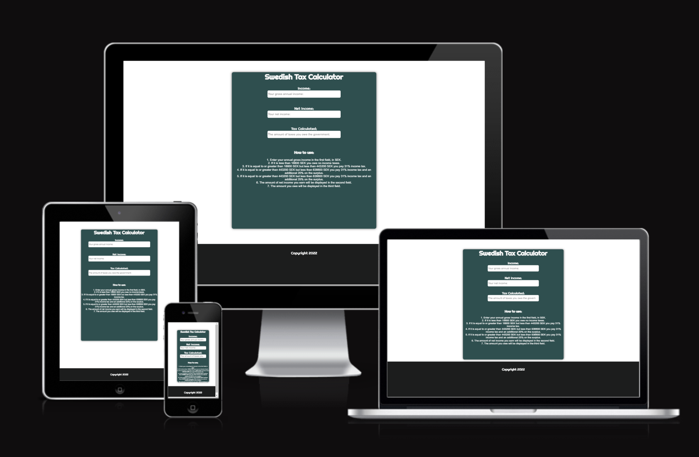

# Income Tax Calculator 

[View the published application on Github]( https://hemenhk.github.io/income-tax-calculator/)

## Project Overview

Income Tax Calculator is a website that aims to provide the user with a simple way of determining how much taxes they owe the government annually. This only applies to Swedish users. This site has been created as part of my second project for Code Institute.

## Table of Contents

1. [Strategy]
    * [Project Goals]
    * [User Intention]
    * [Scope]
    * [Design]
    * [Skeleton]
2. [Features](#features)
    * [Current Features]
    * [Future Features]
3. [Technologies Uses]
4. [Testing]
    * [Validation Testing]
    * [Known Bugs and Fixes]
5. [Deployment]
6. [Credits]